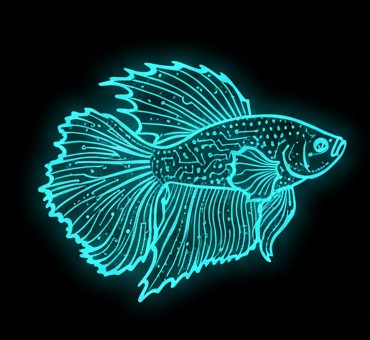

<!-- SPDX-License-Identifier: LicenseRef-FNCL-1.1 | Copyright (c) 2026 Cpt_Kirk -->


# BETTA HA Panel

A runtime-configurable Home Assistant wall panel for ESP32-P4 and ESP32-S3 touchscreen devices. Build your dashboard directly on the device — no YAML edits, no firmware rebuilds.

<p float="left">
  
  
  
</p>
---

## Supported hardware

BETTA HA Panel ships as **four firmware variants**, one per supported device:

| Variant    | Device                                                  | Resolution | Factory image                                                                     |
|------------|---------------------------------------------------------|------------|-----------------------------------------------------------------------------------|
| `panel4`   | Waveshare **ESP32-P4-WIFI6-Touch-LCD-4B** (4")          | 720 × 720  | [betta86-ha-panel-v0.8.2-panel4.factory.bin](release/betta86-ha-panel-v0.8.2-panel4.factory.bin)   |
| `panel10`  | Waveshare **ESP32-P4 Module Nano + 10.1" DSI panel**    | 1280 × 800 | [betta86-ha-panel-v0.8.2-panel10.factory.bin](release/betta86-ha-panel-v0.8.2-panel10.factory.bin) |
| `panels3`  | Guition **ESP32-S3-4848S040** (4")                      | 480 × 480  | [betta86-ha-panel-v0.8.2-panels3.factory.bin](release/betta86-ha-panel-v0.8.2-panels3.factory.bin) |
| `paneljc`  | Guition **JC8012P4A1** ESP32-P4 + ESP32-C6 (10.1")      | 1280 × 800 | Build from source for now |

All variants share the same dashboard engine, web editor, and Home Assistant integration. Pick the image that matches your board.

---

## Main features

- **Live Home Assistant link** — WebSocket connection with REST fallback for forecasts and long-poll states.
- **On-device editor** — BETTA Editor in the browser at `http://<panel-ip>`; drag-and-drop widgets, multi-page layouts, room-grouped entity picker.
- **Widget library** — sensor, button, slider, graph, light, heating, weather, up to 5 day weather forecast, media player, todo list, Roborock, energy dashboard, empty tile.
- **Advanced light control** — brightness, color temperature, RGB — exposed only when Home Assistant reports the capability.
- **Energy dashboard** — automatic grid / solar / battery / gas / water flow visualization driven by the Home Assistant energy model.
- **Graphs** — line, smoothed line, or bar-chart modes; event-rate sampling up to 4096 points with progressive decimation.
- **First-run provisioning** — `BETTA-Setup` Wi-Fi AP, guided Wi-Fi + Home Assistant setup, Quick Setup flow for a starter dashboard.
- **OTA updates** — upload an `.ota.bin` or point to an OTA URL from the web editor; no reflash required after v0.7.1.
- **Multilingual** — built-in English, German, Spanish, French; custom translation JSON upload/download.
- **Touch-friendly UX** — auto-dimming backlight after idle, pointer-capture drag/resize, stable GT911 touch startup.

---

## Getting started

1. **Download** the factory image for your board from the table above.
2. **Flash** it with any ESP32 flasher — for example the browser-based [esptool-js](https://espressif.github.io/esptool-js/):
   - Use the outer USB-C port.
   - Baud rate `115200`, flash offset `0x0`.
   - The factory image includes the ESP32-C6 network coprocessor firmware.
3. **Reboot** the device. It opens a Wi-Fi AP called `BETTA-Setup`.
4. Connect to `BETTA-Setup`, open `http://192.168.4.1`, pick your country, scan for your network and save.
5. After reboot the panel joins your LAN. Open its IP in a browser, link Home Assistant via long-lived access token, and build your first page with **Quick Setup**.

Future updates install via OTA from the editor — no cable needed.


---

## What's new in v0.8.2

- **ESP32-S3 support** — new `panels3` variant for the Guition ESP32-S3-4848S040 (4.8" 480×480 RGB panel, 16 MB flash, 8 MB PSRAM).
- **Guition JC8012P4A1 support** — source build support for the ESP32-P4 + ESP32-C6 10.1" panel with JD9365 MIPI-DSI display and GSL3680 touch.
- **Four-variant builds** — build presets now cover `panel4`, `panel10`, `panels3`, and `paneljc`.
- **MDI weather icons on S3** — clean Material Design Icon weather display on the S3 panel.
- **Release tooling** — `make_factory_bin.ps1` extended; `-Variant both` now packages all four variants in one run.

Full history: [release-notes.md](release-notes.md).

---

## Building from source

Prerequisites: **ESP-IDF v5.5.2**, Python 3.11+, and PowerShell if you want to package release images. The ESP-IDF component manager fetches project dependencies automatically on the first build.

Install ESP-IDF if needed:

```bash
mkdir -p ~/esp
cd ~/esp
git clone --branch v5.5.2 --depth 1 --recursive https://github.com/espressif/esp-idf.git esp-idf-v5.5.2
cd esp-idf-v5.5.2
./install.sh esp32p4,esp32s3
```

Activate ESP-IDF in each new terminal:

```bash
source ~/esp/esp-idf-v5.5.2/export.sh
```

Build with the CMake presets:

```bash
idf.py --preset panel4   build
idf.py --preset panel10  build
idf.py --preset panels3  build
idf.py --preset paneljc  build
```

Flash a connected device:

```bash
idf.py -B build-paneljc flash monitor
```

Package factory and OTA images after building:

```bash
pwsh tools/make_factory_bin.ps1 -Variant paneljc
pwsh tools/make_factory_bin.ps1 -Variant both
```

Build artifacts land in `release/` and `release/ota/`. Previous versions are moved to `release/archive/`.

---

## Editor preview


<p>
  
  
</p>
<p>
  
  

</p>

---

## License

Source released under [LicenseRef-FNCL-1.1](LICENSE). See [release-notes.md](release-notes.md) for per-version changes.
